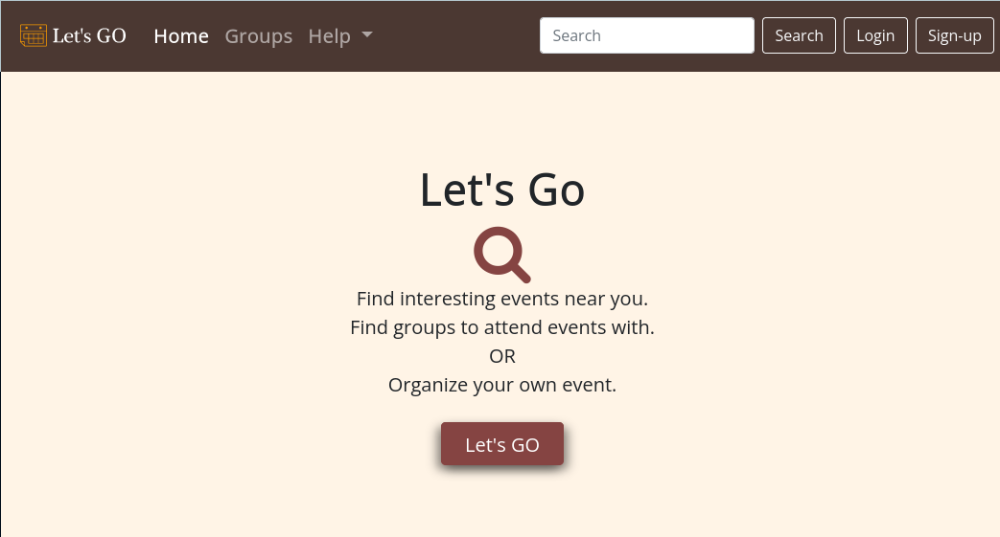

<!-- PROJECT SHIELDS -->
<!--
*** I'm using markdown "reference style" links for readability.
*** Reference links are enclosed in brackets [ ] instead of parentheses ( ).
*** See the bottom of this document for the declaration of the reference variables
*** for contributors-url, forks-url, etc. This is an optional, concise syntax you may use.
*** https://www.markdownguide.org/basic-syntax/#reference-style-links
-->
[![Contributors][contributors-shield]][contributors-url]
[![Forks][forks-shield]][forks-url]
[![Stargazers][stars-shield]][stars-url]
[![Issues][issues-shield]][issues-url]
[![MIT License][license-shield]][license-url]
[![LinkedIn][linkedin-shield]][linkedin-url]


<!-- PROJECT LOGO -->
<br />
<p align="center">
  <a href="https://github.com/rs401/letsgo">
    
  </a>

  <h3 align="center">Let's GO</h3>

  <p align="center">
    App to connect people for gatherings.
    <br />
    <a href="https://github.com/rs401/letsgo"><strong>Explore the docs »</strong></a>
    <br />
    <br />
    <a href="https://github.com/rs401/letsgo">View Demo</a>
    ·
    <a href="https://github.com/rs401/letsgo/issues">Report Bug</a>
    ·
    <a href="https://github.com/rs401/letsgo/issues">Request Feature</a>
  </p>
</p>


<!-- TABLE OF CONTENTS -->
<details open="open">
  <summary><h2 style="display: inline-block">Table of Contents</h2></summary>
  <ol>
    <li>
      <a href="#about-the-project">About The Project</a>
      <ul>
        <li><a href="#built-with">Built With</a></li>
      </ul>
    </li>
    <li>
      <a href="#getting-started">Getting Started</a>
      <ul>
        <li><a href="#prerequisites">Prerequisites</a></li>
        <li><a href="#installation">Installation</a></li>
      </ul>
    </li>
    <li><a href="#usage">Usage</a></li>
    <li><a href="#roadmap">Roadmap</a></li>
    <li><a href="#contributing">Contributing</a></li>
    <li><a href="#license">License</a></li>
    <li><a href="#contact">Contact</a></li>
    <li><a href="#acknowledgements">Acknowledgements</a></li>
  </ol>
</details>


<!-- ABOUT THE PROJECT -->
## About The Project


Here's a blank template to get started:
**To avoid retyping too much info. Do a search and replace with your text editor for the following:**
`rs401`, `letsgo`, `Res401`, `rich.stadnick#gmail`, `Let's GO`, `App to connect people for gatherings.`


### Built With

* [Go](https://golang.org/)
* [Gin](https://gin-gonic.com/)
* [Gorm](https://gorm.io/)
* [PostgreSQL](https://www.postgresql.org/)
* [Redis](https://redis.io/)
* [Docker](https://www.docker.com/)
* []()


<!-- GETTING STARTED -->
## Getting Started

To get a local copy up and running follow these simple steps.

### Prerequisites

This app can be deployed in docker.

* Docker
  

### Installation

1. Clone the repo
   ```sh
   git clone https://github.com/rs401/letsgo.git
   ```
2. Setup Environment Variables
   ```sh
   mv env.sample .env
   vim .env
   ```
3. Orchestrate containers
   ```sh
   docker-compose up --build
   ```


<!-- USAGE EXAMPLES -->
## Usage

Create an account. Join a group. Create a group. Post an event. Attend an event. Live life with Joy.


<!-- ROADMAP -->
## Roadmap

See the [open issues](https://github.com/rs401/letsgo/issues) for a list of proposed features (and known issues).


<!-- CONTRIBUTING -->
## Contributing

Contributions are what make the open source community such an amazing place to learn, inspire, and create. Any contributions you make are **greatly appreciated**.

1. Fork the Project
2. Create your Feature Branch (`git checkout -b feature/AmazingFeature`)
3. Commit your Changes (`git commit -m 'Add some AmazingFeature'`)
4. Push to the Branch (`git push origin feature/AmazingFeature`)
5. Open a Pull Request


<!-- LICENSE -->
## License

Distributed under the MIT License. See `LICENSE` for more information.


<!-- CONTACT -->
## Contact

Your Name - [@Res401](https://twitter.com/Res401) - rich.stadnick#gmail

Project Link: [https://github.com/rs401/letsgo](https://github.com/rs401/letsgo)


<!-- ACKNOWLEDGEMENTS -->
## Acknowledgements

* []()
* []()
* []()


<!-- MARKDOWN LINKS & IMAGES -->
<!-- https://www.markdownguide.org/basic-syntax/#reference-style-links -->
[contributors-shield]: https://img.shields.io/github/contributors/rs401/letsgo.svg?style=for-the-badge
[contributors-url]: https://github.com/rs401/letsgo/graphs/contributors
[forks-shield]: https://img.shields.io/github/forks/rs401/letsgo.svg?style=for-the-badge
[forks-url]: https://github.com/rs401/letsgo/network/members
[stars-shield]: https://img.shields.io/github/stars/rs401/letsgo.svg?style=for-the-badge
[stars-url]: https://github.com/rs401/letsgo/stargazers
[issues-shield]: https://img.shields.io/github/issues/rs401/letsgo.svg?style=for-the-badge
[issues-url]: https://github.com/rs401/letsgo/issues
[license-shield]: https://img.shields.io/github/license/rs401/letsgo.svg?style=for-the-badge
[license-url]: https://github.com/rs401/letsgo/blob/master/LICENSE.txt
[linkedin-shield]: https://img.shields.io/badge/-LinkedIn-black.svg?style=for-the-badge&logo=linkedin&colorB=555
[linkedin-url]: https://linkedin.com/in/richard-stadnick-3b4ab53b/

